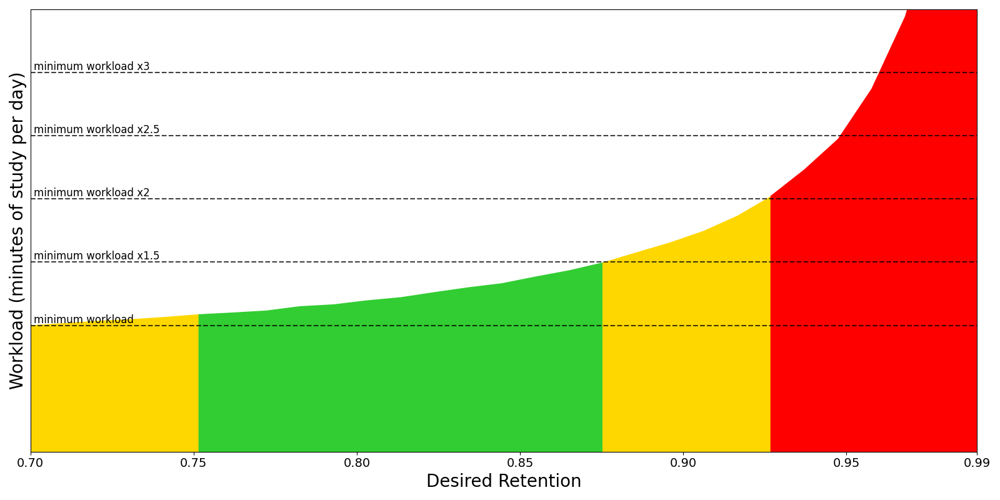

True Recall uses **FSRS v6** (Free Spaced Repetition Scheduler), a modern spaced repetition algorithm that significantly outperforms the classic SM-2 algorithm used by Anki. For a comparison with Leitner, SM-2, and other approaches, see [Why FSRS v6](/concepts/why-fsrs/).

## What is FSRS?

FSRS is a machine learning-based algorithm developed by Jarrett Ye. It models your memory using three components:

1. **Stability (S)** — How long a memory lasts before you're likely to forget
2. **Difficulty (D)** — How hard a card is to learn
3. **Retrievability (R)** — Current probability of successful recall

These parameters are updated after each review based on your rating (Again, Hard, Good, Easy).

## Core Concepts

### Stability

Stability is the time (in days) at which retrievability drops to 90% (or your desired retention). Higher stability = longer intervals.

Factors that increase stability:
- Successful recall (especially "Good" and "Easy")
- Multiple successful reviews
- Longer previous intervals

Factors that decrease stability:
- Forgetting ("Again" rating)
- Long gaps without review

### Difficulty

Difficulty represents how hard a card is to learn. Range: 0-10.

- **Low difficulty (0-3)** — Easy concepts, quick to memorize
- **Medium difficulty (4-6)** — Average difficulty
- **High difficulty (7-10)** — Challenging material, needs more reviews

Difficulty is updated after each review but stabilizes over time.

### Retrievability

Retrievability is the current probability you can recall the answer. It decreases over time according to the forgetting curve.

### Desired Retention

The target probability of recall you want to maintain. Default: 90%.

| Desired Retention | Effect |
|-------------------|--------|
| 85% | Fewer reviews, more forgetting |
| 90% (default) | Balanced |
| 95% | More reviews, less forgetting |

Higher retention = more work. 90% is optimal for most learners.



## The 21 FSRS Weights

FSRS uses 17-21 weights that control how the algorithm behaves:

| Weight Group | Purpose |
|--------------|---------|
| w[0-1] | Initial stability (from rating) |
| w[2-3] | Initial difficulty |
| w[4-5] | Difficulty update after review |
| w[6-7] | Stability update for hard/good |
| w[8] | Stability update for easy |
| w[9-10] | Stability after lapse |
| w[11-16] | Hard/good/easy stability multipliers |
| w[17-20] | Learning/relearning stability |

Use [optimization](/scheduling/fsrs-optimization/) rather than manual editing.

## FSRS States

Cards progress through states:

```
New -> Learning -> Review -> (lapse) -> Relearning -> Review
```

- **New** — Never reviewed, no stability/difficulty data yet
- **Learning** — First few reviews (based on learning steps), short intervals
- **Review** — Graduated from learning, longer intervals (days/months/years)
- **Relearning** — After a lapse (forgot in review), similar to learning but faster

## Interval Calculation

The next interval is calculated to maintain your desired retention. With fuzz applied (plus/minus 2.5% by default) to prevent bunching.

## Optimization

FSRS can optimize its weights based on your review history. This personalizes the algorithm to your learning patterns.

**Requirements:**
- Minimum 400 reviews per preset
- Recommended 1000+ reviews for best results
- Reviews should span multiple days

**How to optimize:** Settings -> True Recall -> FSRS -> Optimize parameters

## FSRS Presets

Presets let you have different FSRS settings for different types of content:

| Preset | Use Case |
|--------|----------|
| Default | General learning |
| Intensive | Exam prep (higher daily limits) |
| Medical | Medical school (optimized for retention) |
| Languages | Vocabulary learning |

Each preset has its own desired retention, daily limits, learning steps, and FSRS weights.

## Further Reading

- [FSRS GitHub Repository](https://github.com/open-spaced-repetition/fsrs4anki)
- [FSRS Whitepaper](https://github.com/open-spaced-repetition/fsrs4anki/wiki/FSRS-v4-Whitepaper)
