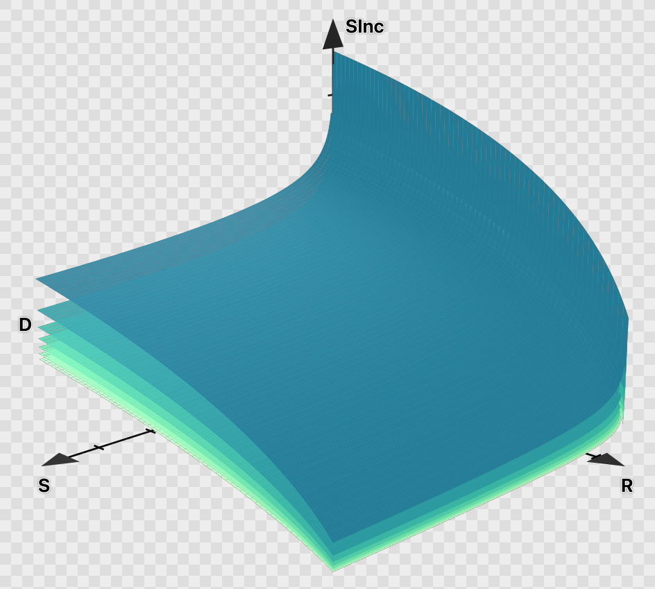
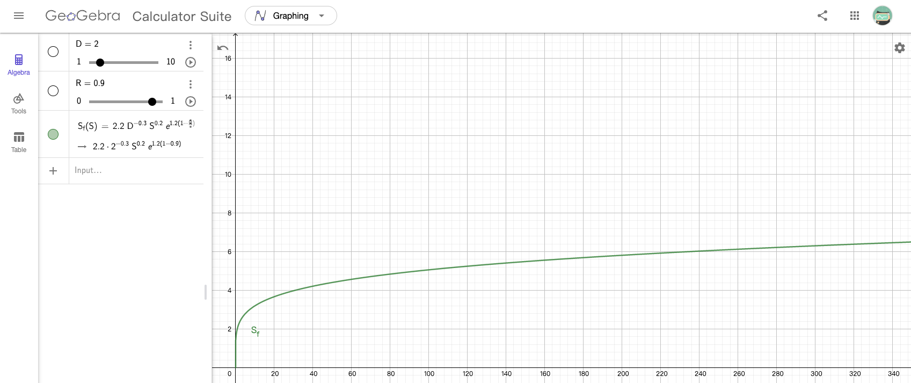
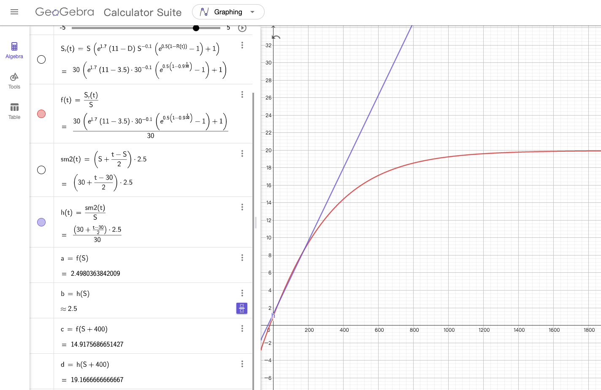
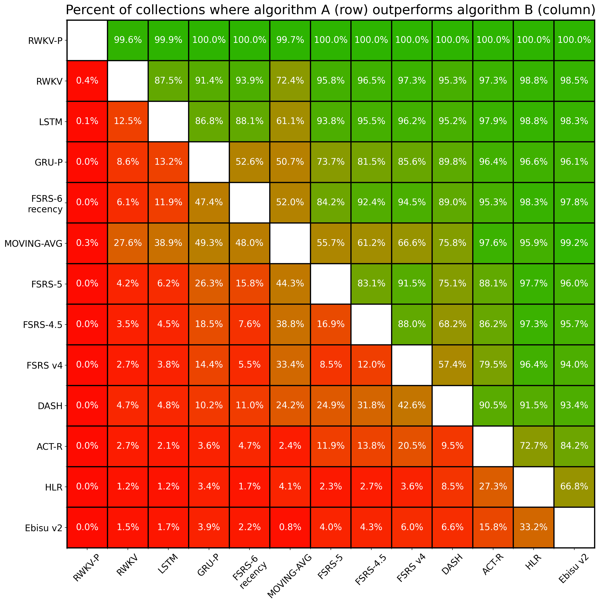

True Recall uses **FSRS v6** — the most advanced open-source spaced repetition algorithm. This page explains why it matters and how it compares to older approaches.

## The problem with older algorithms

### Leitner system

The Leitner box system uses fixed intervals: Box 1 = 1 day, Box 2 = 3 days, Box 3 = 7 days, and so on. Get a card right and it moves up; get it wrong and it goes back to Box 1.

It's simple, but:

- **No memory model** — intervals are arbitrary, not based on how memory works
- **No personalization** — everyone gets the same schedule regardless of ability
- **No retention target** — no way to control how much you remember

### SM-2 (Anki's legacy default)

SM-2 was Anki's default algorithm for over 20 years. It uses an "ease factor" multiplier (starting at 2.5) that adjusts based on your ratings.

Problems with SM-2:

- **Ease hell** — Cards rated "Hard" repeatedly get stuck with low ease factors, creating a spiral of too-short intervals
- **Only 3 parameters** — Too simple to model real memory behavior
- **No retention target** — You can't say "I want 90% recall" and have the algorithm aim for it
- **No optimization** — Parameters are fixed; the algorithm doesn't learn from your history

## What FSRS does differently

FSRS (Free Spaced Repetition Scheduler) is a machine learning-based algorithm developed by [Jarrett Ye](https://github.com/open-spaced-repetition/fsrs4anki). Instead of a single ease factor, it models memory with three components:

- **Stability** — How long until you're likely to forget (in days)
- **Difficulty** — How hard this particular card is for you (0-10)
- **Retrievability** — Your current probability of recalling the answer (0-100%)

With **21 trainable weights**, FSRS can capture patterns that SM-2's 3 parameters simply cannot. See [FSRS Algorithm](/concepts/fsrs-algorithm/) for a technical deep-dive into each component.

### Configurable retention

Set a **desired retention** (default: 90%) and FSRS calculates intervals to maintain that target. Want 95% recall for medical exams? 85% for casual vocabulary? Adjust per [preset](/organization/presets/).

Higher retention means more daily reviews. The chart below shows how workload scales — the green zone (75-88%) is efficient, while pushing above 93% (red zone) increases workload dramatically:

### Personal optimization

After 400+ reviews, FSRS can [optimize its weights](/scheduling/fsrs-optimization/) from your actual review history. The algorithm literally learns how your memory works and adapts accordingly.

### Stability after forgetting

When you forget a card, FSRS doesn't reset to zero. The post-lapse stability function models how much memory strength remains after a lapse, factoring in the card's difficulty and previous stability.

### Handling overdue reviews

FSRS models what happens when you review a card later than scheduled. Unlike SM-2's linear multiplier, FSRS uses a bounded function where stability increase converges to an upper limit — reviewing a card months late doesn't give infinite credit.

## What's new in v6

FSRS v6 adds four weights (17-20) for **short-term memory modeling**:

- **Same-day review handling** — Cards reviewed multiple times in one day are scheduled more accurately
- **Improved forgetting curve** — Better predictions for when you'll actually forget
- **Short-term stability** — Separate modeling for cards still in the learning phase

These improvements are especially noticeable during intensive study sessions with many new cards.

## Algorithm comparison

|  | Leitner | SM-2 | FSRS v6 |
|---|---|---|---|
| **Memory model** | None (fixed boxes) | Ease factor | Stability + Difficulty + Retrievability |
| **Parameters** | 0 | 3 | 21 trainable weights |
| **Personalization** | None | None | ML-based optimization from your data |
| **Retention target** | No | No | Yes (configurable 70-99%) |
| **Short-term memory** | No | No | Yes |
| **Same-day reviews** | No | No | Yes |

## Real-world performance

Benchmarks on 9,999 Anki user collections show FSRS consistently outperforms all other algorithms. The matrix below shows the percentage of users for whom algorithm A (row) outperforms algorithm B (column):

FSRS achieves **10-20% better retention** with **15-20% fewer reviews** compared to SM-2. You remember more while studying less.

## Further reading

- [FSRS Algorithm](/concepts/fsrs-algorithm/) — technical deep-dive into stability, difficulty, weights, and states
- [Scheduling](/concepts/scheduling/) — how intervals, learning steps, and daily limits work
- [FSRS Optimization](/scheduling/fsrs-optimization/) — personalizing weights from your review history
- [FSRS Settings](/configuration/fsrs-settings/) — configuring algorithm parameters
- [FSRS Simulator](/views/fsrs-simulator/) — interactive visualization of how FSRS schedules cards
- [FSRS GitHub](https://github.com/open-spaced-repetition/fsrs4anki) — source code and research
