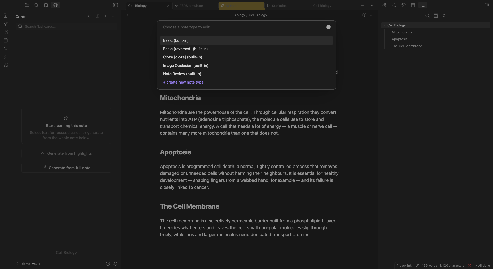

:::caution[My Notes]
:::

The four [built-in note types](/creation/note-types/) cover most use cases. Custom note types are for when you need something they can't do: extra fields, a different card structure, or a layout specific to your subject.

Common reasons to create a custom type:
- **Language learning**: fields for the word, reading (furigana), meaning, example sentence
- **Medical/scientific**: question, answer, and a clinical note field
- **Vocabulary with memory aids**: Front, Back, Mnemonic
- **Two-sided with extra context**: Front, Back, Source, Context

If you're starting out, don't create custom types yet. Learn the built-in types first, then create custom ones when you find yourself adding the same kind of extra information to every card.

## What a Note Type Is Made Of

```
Note type
  ├── Fields       (Front, Back, Mnemonic)
  ├── Templates    (how fields become review cards)
  └── CSS          (appearance during review)
```

Each piece does a different job. Fields hold the data. Templates define what appears on the question and answer sides. CSS controls how it looks.

## Fields

A field is a named slot that holds content. You define the field names when creating the note type, then fill them in when writing cards.

Fields are referenced in templates using double braces:

```
{{Front}}
{{Back}}
{{Mnemonic}}
```

In block format, each field becomes a line:

```markdown
#type/japanese
Word: 水
Reading: みず
Meaning: water
Sentence: 水を飲んでください。
---
```

Field order in the block must match the order you defined in the type. Field names are case-sensitive.

## Card Templates

Each template generates one card. A note type with two templates generates two cards per block. A note type with one template generates one card.

A template has two sides, question and answer:

**Question template:**
```
{{Front}}
```

**Answer template:**
```
{{Front}}
<hr>
{{Back}}
{{#Mnemonic}}
<em>{{Mnemonic}}</em>
{{/Mnemonic}}
```

### Conditional content

Use `{{#FieldName}}...{{/FieldName}}` to show content only when a field is filled in:

```
{{#Mnemonic}}
Memory aid: {{Mnemonic}}
{{/Mnemonic}}
```

Use `{{^FieldName}}...{{/FieldName}}` to show content only when a field is empty:

```
{{^Hint}}
No hint available
{{/Hint}}
```

### Multiple templates = multiple cards

A "Language" note type might have two templates:

- Template 1: "Word" → reveal "Meaning" (recognition)
- Template 2: "Meaning" → reveal "Word" (production)

Both cards use the same field data but test in different directions.


## CSS

CSS controls card appearance during review. You write it once per note type; it applies to all cards of that type.

```css
.card {
  font-family: sans-serif;
  font-size: 1.2em;
  text-align: center;
}

.reading {
  font-size: 0.9em;
  color: var(--sl-color-gray-4);
}
```

Use CSS variables for theme compatibility (light and dark mode):

```css
.card {
  color: var(--text-normal);
  background-color: var(--background-primary);
}
```

## Special Fields

In addition to your custom fields, these built-in variables are available in any template:

| Field | Description |
|-------|-------------|
| `{{Tags}}` | Note tags |
| `{{Type}}` | Note type name |
| `{{Deck}}` | Project name |
| `{{Subdeck}}` | Sub-project name |

## Converting Between Note Types

You can change the note type of existing cards:

1. Open [Card Browser](/views/card-browser/)
2. Select cards to convert
3. Right-click → Change note type
4. Select the new note type
5. Map old fields to new fields
6. Confirm

## Managing Note Types

Create, edit, and delete note types in the **Note Type Manager**. Open it from the type picker in the [Flashcard Editor](/views/flashcard-editor/) (the fields action next to the note type). Both the Note Type Manager and the Card Types Editor open in their own popout windows, so you can keep the editor you came from visible while you work.



The manager lists every note type, built-in and custom, and lets you add a new type, rename it, edit its fields, or delete a custom type. Built-in types (Basic, Cloze, Image Occlusion) cannot be deleted.

## Editing Card Templates

To change *how* a note type turns fields into cards, open its **Card Types Editor**. The Command Palette command **Manage note types** asks which note type to edit (or lets you create a new one with **+ create new note type**) and opens the Card Types Editor for it in a popout window. This is where you edit the [card templates](#card-templates) and [CSS](#css) described above: add or remove templates (each template produces one card), and adjust the question and answer layout for the type.

Editing a template updates every existing card of that type the next time it's rendered, so you can refine a layout without recreating cards.

## What to Read Next

- [Note Types](/creation/note-types/): the four built-in types and when to use each
- [Creating Flashcards](/creation/creating-flashcards/): block format syntax for writing cards in your notes
- [Flashcard Editor](/views/flashcard-editor/): where you pick a note type and fill in card fields
