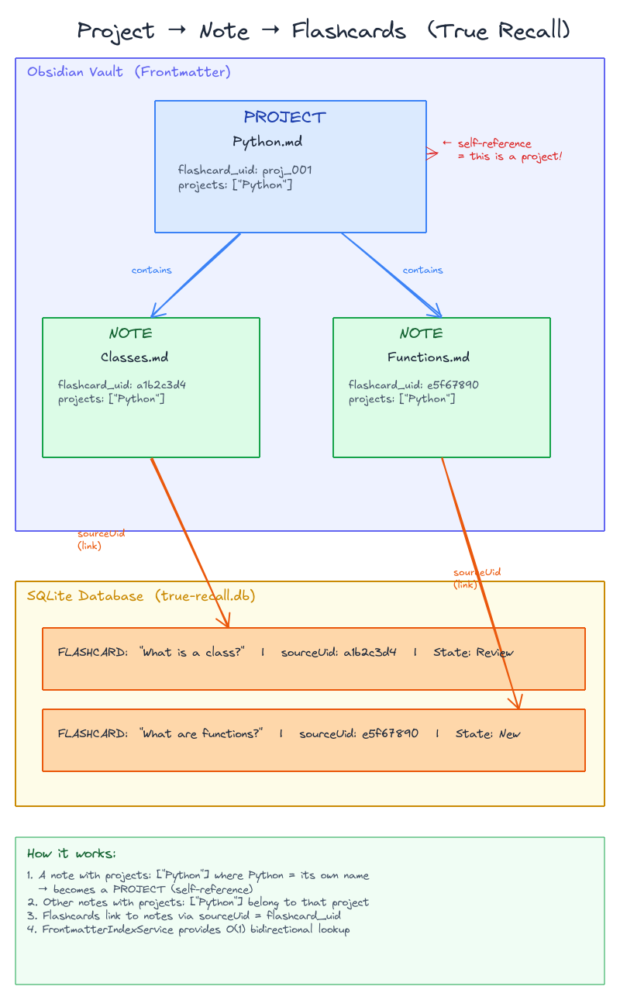

Projects group notes together for focused study. A project can span multiple notes, a note can belong to multiple projects, and projects nest inside other projects — like Anki decks, but more flexible.

## What Are Projects?

A project is a named collection of notes. Notes belong to projects (not individual cards), and cards inherit their source note's project memberships.

True Recall supports two types of projects:

| Type | How it works | Best for |
|------|-------------|----------|
| **Link-based** | A note with `project: true` — members are its `[[wikilinks]]` | Cross-folder grouping, curated collections |
| **Folder-based** | Auto-discovered from folders containing flashcard notes | Automatic organization, minimal setup |

## Link-Based Projects

A note becomes a project by adding `project: true` to its frontmatter. The project's **members** are determined by the note's outgoing wiki links — any note linked via `[[wikilink]]` in the project note's body becomes a member.

### Creating a Link-Based Project

1. Add `project: true` to a note's frontmatter
2. Link to member notes using `[[wikilinks]]` in the note body

```markdown
---
project: true
---

# Machine Learning

Study materials for ML fundamentals.

## Member Notes
- [[Linear Regression]] — core regression techniques
- [[Gradient Descent]] — optimization basics
- [[Neural Networks]] — deep learning intro
```

In this example, `Machine Learning.md` is the project, and the three linked notes are its members. The member notes need **no special frontmatter** — they just get linked from the project note.

:::tip
Since project notes are regular Obsidian notes, use them as Maps of Content (MOCs). Write overview content, link to resources, and add study goals alongside the member links.
:::

### How Membership Works



True Recall reads the project note's **outgoing wiki links** (via Obsidian's `resolvedLinks`). Every `.md` file linked from the project note is a member. This means:

- Members are determined by the **project note**, not by member notes
- Adding a member = adding a `[[wikilink]]` to the project note
- Removing a member = removing the link from the project note
- Member notes don't need any `project`-related frontmatter

## Folder-Based Projects

When enabled, True Recall auto-discovers projects from your folder structure. Any folder containing notes with flashcards automatically becomes a project.

### How It Works

1. True Recall finds all notes with `flashcard_uid` in frontmatter
2. Groups them by parent folder
3. Each folder with flashcard notes becomes a project
4. Nested folders become sub-projects automatically

```
Biology/
├── Biology.md              ← folder note (optional)
├── cell-biology.md         ← member (has flashcards)
├── genetics.md             ← member (has flashcards)
└── Ecology/
    ├── ecosystems.md       ← member of Ecology sub-project
    └── biomes.md           ← member of Ecology sub-project
```

### Enabling Folder Projects

Folder projects are controlled by the `folderProjectsEnabled` setting in True Recall's settings.

### Folder Notes

A **folder note** is a note named the same as its folder (e.g., `Biology/Biology.md`). Folder notes can:

- **Opt out**: Add `project: false` to frontmatter to exclude the folder from being a project
- **Add external members**: Include `[[wikilinks]]` in the folder note's body to add notes from outside the folder

```yaml
# Biology/Biology.md — opt out of auto-project
---
project: false
---
```

### Excluded Folders

Configure `excludedFolders` in settings to prevent specific folders from becoming projects.

## Sub-Projects (Nesting)

A project that links to another project creates a **parent-child** relationship. The linked project becomes a sub-project.

### Link-Based Sub-Projects

When a project note links to another note that also has `project: true`, the linked note becomes a sub-project:

```markdown
---
project: true
---

# Machine Learning

- [[Neural Networks]]    ← this is also project: true → sub-project
- [[Decision Trees]]     ← this is also project: true → sub-project
- [[feature-engineering]] ← regular note → direct member
```

```markdown
---
project: true
---

# Neural Networks

- [[backpropagation-notes]]
- [[CNN Architectures]]  ← also project: true → sub-sub-project
```

This creates the hierarchy:

```
Machine Learning/                        ← root project
├── Neural Networks/                     ← sub-project
│   ├── backpropagation-notes.md         ← regular member
│   └── CNN Architectures/               ← sub-sub-project
│       └── resnet-paper.md
├── Decision Trees/                      ← sub-project
│   └── random-forests.md
└── feature-engineering.md               ← direct member
```

### Folder-Based Sub-Projects

Nested folders automatically create sub-project relationships. A subfolder with flashcard notes becomes a child of its parent folder project.

### Mixed Hierarchies

Link-based and folder-based projects are merged into a single hierarchy. If a folder note also has `project: true`, its link-based members and folder-based members are combined.

## It's a Graph, Not a Tree

Unlike Anki's strict deck tree, True Recall projects form a **directed graph**:

- A note can be linked from **multiple projects** (e.g., "Linear Algebra" linked from both "Machine Learning" and "Mathematics")
- A project can have **multiple parents** if linked from several parent projects
- This mirrors how knowledge actually connects — topics don't fit neatly into one hierarchy

In the Projects View, a note linked from multiple projects appears under each parent.

## Creating Projects

### From Projects View

1. Click the **+** button in the Projects panel header
2. Select a note to become the project
3. The note gets `project: true` added to its frontmatter
4. Link member notes using `[[wikilinks]]` in the note body

### Creating Sub-Projects

1. In the Projects View, find the parent project
2. Click the **folder-plus** icon (Create sub-project)
3. Select a note to become the sub-project
4. The child note gets `project: true` in frontmatter, and the parent project note gets a link to the child

### Manual Setup

Add `project: true` to a note's frontmatter, then link to member notes in the body:

```yaml
---
project: true
---
```

## Reviewing by Project

### Cascading Review

When you review a project, True Recall includes cards from:
1. **Direct members** — notes linked from this project
2. **Sub-project members** — all notes in sub-projects, recursively

Example: Reviewing "Machine Learning" includes cards from:
- `feature-engineering.md` (direct member)
- `backpropagation-notes.md` (in sub-project Neural Networks)
- `resnet-paper.md` (in sub-sub-project CNN Architectures)
- `random-forests.md` (in sub-project Decision Trees)

### Start Project Review

1. Open the **Projects View** panel
2. Click the **play** button on any project
3. A review session opens filtered to that project (including all sub-projects)

### Custom Study

For more control:
1. Click the **sliders** icon on a project
2. The Session Builder opens scoped to that project
3. Configure additional filters (new only, due only, etc.)

## Project-Level FSRS Presets

Each project can have its own [FSRS preset](/configuration/fsrs-presets/) — a scheduling profile that applies to all cards in the project. Add `fsrs_preset` to the project note's frontmatter:

```yaml
---
project: true
fsrs_preset: "Critical"
---
```

When you study from this project, all cards use the "Critical" preset (higher retention, more learning steps) unless a note has its own override. This includes studying individual notes within the project -- clicking Study on a note in the Projects tab passes the project's context.

This is **context-sensitive**: the same card can use different presets depending on which project you start studying from. Even clicking Study on a single note within a project carries that project's preset. For example, a note linked from both "Medical Exam" (preset: Critical) and "General Review" (preset: Default) will use whichever project's preset you launch the session from.

Projects with assigned presets show a small **badge** next to their name in the dashboard.

For the full resolution order and configuration options, see [FSRS Presets — Resolution Hierarchy](/configuration/fsrs-presets/#resolution-hierarchy).

## Project Statistics

Each project shows **aggregated statistics** that include sub-project cards:

| Stat | Color | Description |
|------|-------|-------------|
| **New** | Blue | Cards never reviewed |
| **Learning** | Orange | Cards in learning/relearning phase |
| **Due** | Green | Review cards due today |
| **Total** | — | All active cards |

A parent project's counts are the sum of its own cards plus all descendant sub-project cards.

## Comparison with Anki Decks

| Feature | Anki | True Recall |
|---------|------|-------------|
| **Structure** | Strict tree (`::` separator) | Flexible graph (multi-parent) |
| **Membership** | Card belongs to one deck | Note linked from any number of projects |
| **Nesting** | Via deck name: `A::B::C` | Via project-to-project links |
| **Multi-parent** | Not possible | Supported |
| **Storage** | SQLite `decks` table | `project: true` frontmatter + wiki links |
| **Auto-grouping** | None | Folder-based projects |
| **Review cascade** | Yes | Yes |
| **Stats aggregation** | Yes | Yes |

## Best Practices

### Start Simple

- Use **folder projects** for automatic organization if your vault is folder-structured
- Create **link-based projects** for cross-folder grouping or curated study sets
- Add sub-projects only when a project grows large

### Use Project Notes as MOCs

Since project notes are regular notes, you can:
- Write overview content and summaries
- Link to external resources and references
- Add study goals or exam dates
- Include context alongside the member links

### Naming Conventions

Use consistent names:
- `Book: <title>` for book reading projects
- `Course: <name>` for educational content
- `Exam: <subject> <date>` for exam preparation

### Review Rotation

- Review root projects for broad coverage
- Review sub-projects for focused deep dives
- Use aggregated stats to spot which areas need attention

## Technical Details

### How the Project Graph Is Built

1. True Recall finds all notes with `project: true` in frontmatter (via `FrontmatterIndexService`)
2. For each project note, outgoing wiki links are read (via Obsidian's `resolvedLinks`)
3. Links to other `project: true` notes become **child projects**; other linked notes become **members**
4. If folder projects are enabled, folders with flashcard notes are discovered separately
5. Both hierarchies are merged — overlapping nodes (e.g., a folder note with `project: true`) combine their members

### Cycle Protection

If Project A links to Project B, and Project B links to Project A, True Recall handles this gracefully with visited-set tracking during traversal. No infinite loops.

### Performance

- Project graph is built once and cached in state
- Stats aggregation uses a single pass over all cards
- Descendant computation uses DFS with cycle protection
- Folder project discovery is cached and invalidated on vault changes

## Troubleshooting

### Project Not Showing in Projects View

- Verify the note has `project: true` in its frontmatter (not `project: false` or missing)
- For folder projects, ensure `folderProjectsEnabled` is on in settings
- Check that the folder isn't in `excludedFolders`
- Reload the plugin to rebuild the index

### Note Not Appearing as Project Member

- Check that the project note **links to** the member note via `[[wikilink]]`
- The link must be in the project note's body, not the member's
- Verify the linked note exists (no broken links)
- For folder projects, verify the note has `flashcard_uid` and is in the correct folder

### Sub-Project Not Nested Correctly

- Verify the child note has `project: true` in frontmatter
- Verify the parent project note contains a `[[link]]` to the child project note
- Both notes must have `project: true` for the parent-child relationship to form

### Stats Don't Aggregate

- Ensure the parent-child link relationship is valid
- Reload the plugin to rebuild the project graph
- Check the Projects View — sub-projects should appear indented under the parent

### Cards Not Appearing in Parent Review

- Verify the note is linked from the sub-project (check the sub-project note's body)
- The sub-project must have `project: true` and be linked from the parent project
- Cards follow their source note's project membership — check the note, not the card

### Duplicate Projects

- Check for case differences in note names ("Project" vs "project")
- If both a folder project and link project point to the same note, they merge automatically
- Check for duplicate `project: true` notes with similar names
