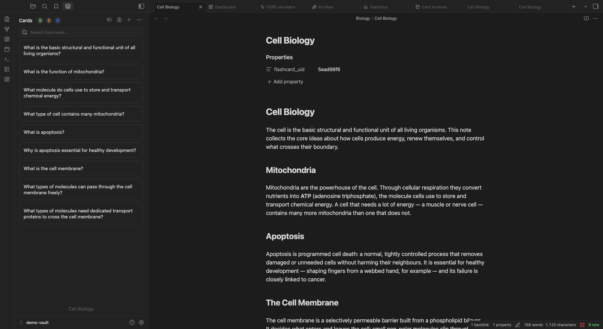

:::caution[My Notes]
:::

The **AI Inbox** is where deferred [AI Workspace](/plugins/ai-assistant/) work waits for you. Every AI request (a generation run, a Card Polish preset, a question in the Ask AI panel) becomes a **thread**. When you close a thread before applying its drafts, or a preset is set to land its result in the inbox, it shows up here as **Later**, so you can keep working and come back to review a batch of proposals when it suits you.

## Opening the Inbox

Open it with the **Open AI assistant inbox** command from the Command Palette. The [Flashcard Panel](/views/flashcard-panel/) also deep-links here when the active note has pending AI drafts, and the docked **Ask AI** panel (command "Open ask AI panel") has a shortcut to it.

## Layout

The header reads **AI inbox / Review queue**, with the number of active items, a "N to review" counter of pending proposals, and an inbox-wide **Apply all** button.

Below it, the inbox lists **threads** that still have proposals to act on, plus any standalone tasks that need attention. Each row shows:

- the thread title and which tool produced it (**Generator**, **Card Polish**, or **Assistant**),
- a status pill (for example "3 to review", "reviewed", "working", or "failed"),
- a delete button to drop the conversation.

Failed tasks get a **Retry** button. When nothing is pending, the inbox says "Nothing needs your attention".

## Working a Thread

Click a row to expand the thread in place. You see the conversation, the proposals it produced (new cards, card rewrites, note edits) and, for polish threads, the card they apply to. AI turns render as Markdown, LaTeX included.

- **Per proposal**: edit the draft fields, then **Apply** or **Reject** it. If the target changed since the draft was made, the inbox flags a conflict and offers **Apply anyway**.
- **Per thread**: **Apply** / **Apply all (N)** applies every pending proposal in the thread.
- **Inbox-wide**: the header's **Apply all** applies every pending proposal across all threads in one step.

Applying a proposal writes the card or note exactly as it appears in the draft, including any edits you made before applying. Applied AI rewrites are counted in the card's **AI Edits** counter ([Card Browser](/views/card-browser/)).

Thread footer actions:

| Action | What it does |
|--------|--------------|
| **Undo AI** | Revert everything this thread applied |
| **Later** | Keep the thread in the inbox for another time |
| **Discard** | Drop the thread and its unapplied proposals |
| **Close** | Collapse the thread |

## Deferring and Archiving

- Threads you're not ready to act on stay in the inbox marked **Later**.
- Once a thread is fully settled (every proposal applied or rejected) it **archives automatically** and drops out of the inbox. Archived conversations stay available as history in the AI Workspace.
- A preset marked auto-apply lands its change immediately and keeps the thread as history; anything that conflicts falls back to the inbox rather than being dropped.

## What to Read Next

- [AI Workspace](/plugins/ai-assistant/): how threads and proposals are created, and the Ask AI panel
- [Card Polish](/plugins/card-polish/): the presets whose results land here
- [Flashcard Panel](/views/flashcard-panel/): the per-note AI drafts strip that links here
- [Dashboard](/views/dashboard/): your day-to-day review hub
