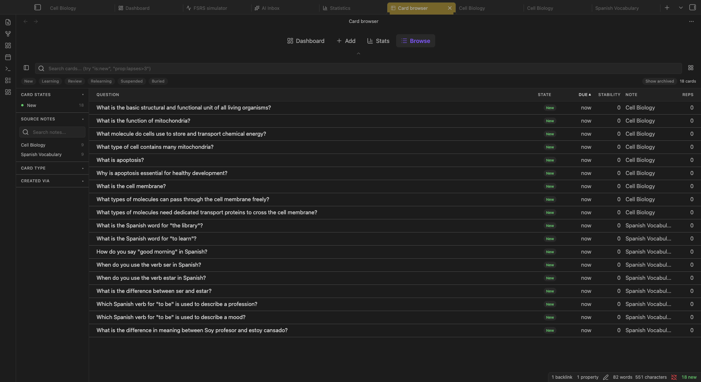

:::caution[My Notes]
:::

The **Card Browser** gives you a searchable, filterable view of every card in your database, across all notes and projects. Use it to find cards that need attention (high lapse counts, low stability, heavy AI editing), audit specific note collections, or perform bulk operations like suspending or deleting groups of cards.

## Opening the Browser

- **Command palette:** `Cmd/Ctrl + P` → "Open card browser"
- **Flashcard Panel:** More Actions → "Open card browser"
- **Dashboard:** The Card Browser link in the footer area

:::note[Desktop only]
The dense table with keyboard navigation is a desktop view. On phones use the [Flashcard Panel](/views/flashcard-panel/) to manage a note's cards.
:::

## Layout

```
+================================================================+
|  🔍 Search or filter...   [New] [Learning] [Review] [Relearning]|
|  [Show archived]          [Suspended] [Buried]   [Columns ▾]    |
+============================+===================================+
|  SIDEBAR FACETS            |  CARD TABLE                       |
|                            |                                   |
|  Card States               |  Question     Note    State  Reps |
|  ○ New (142)               |  ─────────────────────────────── |
|  ○ Learning (23)           |  What is...   Bio.md  New    0   |
|  ○ Review (891)            |  Define...    Bio.md  Review 12  |
|  ○ Suspended (14)          |  {{c1::...}}  Phys.md New    0   |
|                            |                                   |
|  Source Notes              |  [Selected: 3]  [Suspend] [Del]  |
|  ○ Biology.md (234)        |                                   |
|  ○ Physics.md (89)         |                                   |
|                            |                                   |
|  Card Type                 |                                   |
|  ○ basic (743)             |                                   |
|  ○ cloze (312)             |                                   |
|                            |                                   |
|  Created Via               |                                   |
|  ○ ai (901)                |                                   |
|  ○ manual (155)            |                                   |
+============================+===================================+
```



The left sidebar contains **facets**: clickable filters that show counts. The right panel is a sortable table of matching cards. Click any row to preview the full card, including its edit counters.

---

## Query Syntax

The search bar accepts a powerful query language. Type a query and press Enter (or just type; results update as you go).

### State tokens

Filter by FSRS card state:

```
is:new
is:learning
is:review
is:relearning
is:suspended
is:buried
```

Negate any token with `-`:

```
-is:suspended        → all cards except suspended ones
```

:::note
`is:due` and `is:overdue` are accepted but currently behave as aliases for `is:review` rather than strict date-window filters.
:::

### Property filters

Filter by numeric properties using `prop:<property><operator><value>`:

| Property shorthand | Full name | What it measures |
|--------------------|-----------|-----------------|
| `s` | `stability` | Memory stability in days |
| `d` | `difficulty` | Card difficulty (0–1, higher = harder) |
| `r` | `retrievability` | Current recall probability (0–1) |
| `ivl` | `interval` | Current interval in days |
| `reps` | | Total number of reviews |
| `lapses` | | Times the card was forgotten (rated Again) |
| `edits` (or `edit`) | | Times the card's content was rewritten by hand (since 2.3.0) |
| `aiedits` | | Times the card's content was rewritten by AI (since 2.3.0) |

Operators: `>`, `<`, `>=`, `<=`

Examples:

```
prop:lapses>3         → cards you've failed more than 3 times
prop:d>=0.8           → high-difficulty cards
prop:stability<7      → cards with less than a week of stability
prop:reps>=20         → well-reviewed cards
prop:interval>100     → mature cards (100+ day intervals)
prop:aiedits>0        → cards that Card Polish or the assistant has rewritten
prop:edits>3          → cards you keep rewriting by hand
```

The edit counters only move when the content actually changes, so saving an untouched field does not count as an edit. They merge across devices by taking the maximum, not last-writer-wins.

### Other tokens

```
note:"Biology"        → cards from notes whose name contains "Biology"
type:basic            → filter by card type (basic | cloze | reversed | image-occlusion)
via:ai                → cards created by AI generation (ai | manual | anki_import)
added:7               → cards added in the last 7 days
reviewed:30           → cards reviewed in the last 30 days
mitochondria          → plain text search across question and answer content
```

### Combining tokens

All tokens are ANDed together: every condition must match:

```
is:review prop:lapses>2 note:"Biology"
→ review-state cards that have lapsed more than twice, from Biology notes

is:new type:cloze added:14
→ new cloze cards added in the last two weeks

-is:suspended prop:d>=0.7
→ non-suspended cards with difficulty 0.7 or higher
```

---

## Common Queries

| Goal | Query |
|------|-------|
| Find problem cards | `prop:lapses>5` |
| Find cards you haven't touched | `is:new added:30` |
| Find high-difficulty cards | `prop:d>=0.8 is:review` |
| Find AI-generated cards from a note | `via:ai note:"Lecture 3"` |
| Find cards with very short intervals | `prop:interval<3 is:review` |
| Find recently added cards | `added:7` |
| Find all suspended cards | `is:suspended` |
| Find cards the AI has rewritten | `prop:aiedits>0` |

---

## UI Filters and Controls

### Toolbar chips

Quick-access state filters. Click a chip to toggle it: **New**, **Learning**, **Review**, **Relearning**, **Suspended**, **Buried**. Click an active chip again to clear it.

### Show Archived

Toggle to include cards from archived notes in the results.

### Column Picker

Click **Columns ▾** to show/hide table columns. Visible by default: Question, State, Due, Stability, Note, Reps. Hidden by default: Answer, Difficulty, Lapses, Interval, Created, Last Review, Type, Created Via, **Edits**, **AI Edits**, Last Edited, Preset. Every column is sortable.

### Sidebar Facets

Click any facet item to apply it as a filter. Click again to remove it. Active facets are highlighted.

| Facet | Description |
|-------|-------------|
| **Card States** | Filter by FSRS state (New, Learning, Review, Relearning, Suspended, Buried) |
| **Source Notes** | Filter to cards from a specific note |
| **Card Type** | Filter by card format (basic, cloze, reversed, image-occlusion) |
| **Created Via** | Filter by how the card was created (AI, manual, Anki import) |
| **Remove orphaned cards** | Action button to delete cards whose source note no longer exists |

---

## Selection and Bulk Operations

### Selecting cards

Right-click any row in the table to select it. Continue right-clicking to add more cards to the selection. A selection count badge appears at the bottom of the table.

### Bulk action bar

When cards are selected:

| Action | Description |
|--------|-------------|
| **Suspend** | Exclude selected cards from review sessions |
| **Unsuspend** | Re-include suspended cards in reviews |
| **Unbury** | Bring buried cards back today |
| **Forget** | Reset FSRS scheduling to New state (clears review history) |
| **Change type** | Convert to a different note type with field mapping |
| **Move** | Move selected cards to another source note |
| **Delete** | Permanently remove selected cards (confirmation required) |

Bulk operations are undoable with **Undo last flashcard action** (`Cmd/Ctrl + Z`).

### Example: Suspend high-lapse cards

1. Type `prop:lapses>5` in the search bar
2. The table shows only cards you've failed 5+ times
3. Right-click the first result to select it
4. Shift-click the last result to extend the selection
5. Click **Suspend** in the bulk bar; these cards leave your review queue until you unsuspend them

---

## Known Limitations

1. `project:` and `preset:` tokens are parsed and suggested in autocomplete, but are not currently applied in SQL filtering; they have no effect.
2. `note:` resolution is basename-based: if two notes share the same filename (in different folders), results may be ambiguous.
3. `is:due` and `is:overdue` are not strict due-date filters; they behave as `is:review` aliases.

**Practical recommendation:** Use query tokens for state, property, type, and source filters. Use the chips and sidebar facets for fast narrowing when you don't need to type a query.

---

## What to Read Next

- [Flashcard Panel](/views/flashcard-panel/): per-note card management
- [Dashboard](/views/dashboard/): project and note overview
- [Statistics](/views/statistics/): aggregate analytics across your collection
- [Card Polish](/plugins/card-polish/): the source of most `aiedits`
