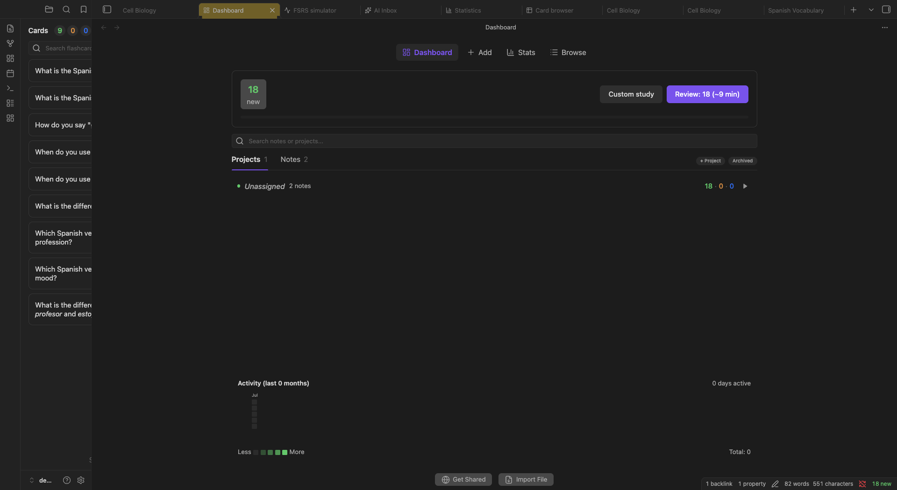

:::caution[My Notes]
:::

The **Dashboard** is your command center. It shows every note that has flashcards, lets you organize notes into projects, and gives you a quick picture of what's due today. Start your study sessions here, rearrange your knowledge structure, and archive things you no longer need.

## Opening the Dashboard

- **Command palette:** `Cmd/Ctrl + P` → "Open dashboard"
- **Ribbon icon:** Click the grid icon in the left ribbon
- **Status bar:** Click the card counts in the bottom-right status bar (e.g., `28 new · 3 lrn · 354 due`)

<!-- TODO PHOTO -->

## Layout

The Dashboard is organized from top to bottom:

1. **Today Action Bar**: due/new/learning counts, estimated study time, progress bar, a **Review** button to start today's session, and a **Custom study** button
2. **Recently Studied**: quick-access row of recently studied notes (only shown when applicable)
3. **Tabs**: **Projects**, **Notes**, **Custom** (your custom study decks), and **Orphaned** (only visible when orphaned notes exist)
4. **Search & Archived toggle**: filter rows in real time; toggle archived items visibility
5. **Heatmap**: a contribution-style activity graph showing your review history
6. **Save & sync status**: a small "Saved locally · Synced 5m ago" line (see [Save and sync status](#save-and-sync-status))
7. **Bottom Action Bar**: Get Shared and Import File buttons

You can hide the top of the Dashboard (today's summary and recently studied notes) with `Settings → True Recall → General → "Dashboard" → "Show dashboard header"`. See [General Settings](/configuration/general/).

## Today Action Bar

The bar at the top gives you an at-a-glance summary:

- **Color-coded badges** showing due, new, and learning card counts
- **Review button**: labeled "Review: X (~Ymin)" with estimated study time, or "All caught up!" when nothing is due
- **Custom study button**: opens the custom study builder (see [Custom Study](#custom-study))
- **Progress bar**: stacked horizontal bar showing the distribution of new/review/learning cards
- **Study summary**: shows "X studied · Y min" when you've already studied today

### Daily target

The number of review cards the **Review** button offers follows your daily target. Since 2.0.0 the target is *conscious*: it is anchored to the pace you actually sustain, not a fixed number. You pick it in `Settings → True Recall → FSRS → "Load balance" → "Daily target"`:

- **Automatic (suggested from your pace)**: the suggested target is your median pace on active days, never below the "floor" (the upcoming dues per day, below which the backlog grows).
- **Manual**: set "Target daily reviews" yourself. Reference chips show your **Floor**, **Your median**, and **Good days** (75th percentile) pace, and a catch-up preview tells you when the current backlog clears at that target (for example, "Backlog of 240 cards clears in ~12 days").

See [Workload Management](/scheduling/workload-management/) for the load-balancing side of this.

## Recently Studied

When you've studied notes recently, a row of quick-access buttons appears below the Today bar. Each button shows a mini donut chart with the note's due/new/learning breakdown. Click any note to jump straight into reviewing it.

---

## Projects Tab

The Projects tab shows your notes organized into a hierarchy. Each project row displays how many cards are due and can be expanded to show its member notes.

### What you see

- **Project row**: name, total cards due across all member notes, estimated minutes to complete, a **Study** button
- **Note rows** (nested under their project): note name, cards due, estimated study time
- **Unassigned notes**: notes with cards that don't belong to any project appear at the bottom

Each row shows a color-coded due count. Green means nothing is due. Orange means some cards are due for review today.

<!-- TODO PHOTO -->

### Starting a review from the Dashboard

Click **Study** on a project row to launch a review session scoped to that project: only cards from notes in that project are included. Click **Study** on a note row to review cards from that specific note only.

### Project row context menu

Right-click any project to access:

| Action | Description |
|--------|-------------|
| Study | Launch a review session for the whole project |
| Custom session | Build a filtered session (states, limits, card types) |
| Go to note | Open the project's linked note in the editor |
| Rename | Change the project name (renames the underlying note file) |
| Set FSRS preset | Assign an FSRS preset to the project (writes `fsrs_preset` to the note's frontmatter; member notes inherit unless they set their own) |
| Archive / Unarchive | Toggle project visibility (sets `archived` in frontmatter) |
| **Scheduling** ▸ | Per-project scheduling actions, see below |
| **Export** ▸ | **Anki (.apkg)** or **CSV** |
| **Project** ▸ **Create sub-project** | Add a child project under this project |
| **Project** ▸ **Move children to…** | Reassign all child notes to a different project |
| **Project** ▸ **Dissolve project** | Remove the project but keep its child notes (they become unassigned) |
| **Project** ▸ **Delete project** | Remove the project and unlink children |

### Per-project scheduling actions

The **Scheduling** submenu (added in 1.9.7) applies FSRS scheduling tools to one project instead of your whole collection:

| Action | Description |
|--------|-------------|
| Workload forecast… | Show the upcoming due-card forecast for this project |
| Reschedule all cards | Recompute due dates for every reviewed card in the project with the current FSRS parameters |
| Reschedule cards reviewed in the last 7 days | Same, limited to recently reviewed cards |
| Schedule a break… | Push the project's due cards past a date range (see [Scheduled Breaks](/scheduling/workload-management/#scheduled-breaks)) |
| Postpone cards… / Advance cards… | Shift due review cards later or earlier by a number of days |
| Flatten future due cards… | Spread a due-date spike across the following days |
| Balance workload… | Run load balancing for this project only |

Every action reports how many cards it touched, and each one is undoable with `Cmd/Ctrl + Z`.

### Drag-and-drop organization

Drag rows to reorganize your hierarchy without menus:

| Drag | Drop | Result |
|------|------|--------|
| Project → another project | Target project | Nest as a subproject |
| Note → a project | Target project | Add note to that project |
| Note → another note | Empty area between notes | Create a new project containing both notes |
| Unassigned note → top drop zone | Top of unassigned area | Convert to project (`project: true`) |
| Unassigned note → bottom drop zone | Bottom of unassigned area | Archive the note |
| Note or project → root drop zone | Bottom of the list | Remove from parent (unnest) |

:::tip[Building your structure]
You don't need to plan your project hierarchy upfront. Start by creating a few notes and reviewing them individually. Once you have enough notes on related topics, drag them onto each other to create a project.
:::

---

## Notes Tab

The Notes tab shows every note in your vault that has at least one flashcard in the database. Unlike the Projects tab, there's no hierarchy: it's a flat list, sorted by due count.

This is useful when you want to study a specific note regardless of which project it belongs to, or when you want to audit which notes have cards.

<!-- TODO PHOTO -->

### Note row context menu

Right-click any note to access:

| Action | Description |
|--------|-------------|
| Study | Review cards from this note |
| Custom session | Build a filtered session for this note |
| Go to note | Open the note in the editor |
| Rename | Rename the note (renames the file) |
| Set FSRS preset | Assign an FSRS preset to the note (writes `fsrs_preset` to the note's frontmatter; overrides any inherited project preset) |
| Archive / Unarchive | Toggle note visibility (sets `archived` in frontmatter) |
| **Convert to project** | Mark this note as a project with `project: true` (appears for unassigned notes) |
| **Remove project status** | Remove the `project: true` marker (appears for explicit projects) |
| **Assign to project** | Add this unassigned note to an existing project (appears for unassigned notes) |
| Detach from project | Remove this note from its parent project (appears inside Projects tab) |
| Select | Enter selection mode with this note selected |

### Orphaned Notes

The **Orphaned** tab appears when one or more notes in your database no longer exist on disk: the file was renamed, moved, or deleted after cards were collected.

Orphaned cards remain in the database and can still be reviewed, but they can't be linked back to a note. Use the [Card Browser](/views/card-browser/) to find orphaned cards (`note:"deleted-note-name"`) and delete or move them to a live note.

---

## Custom Study

Since 2.0.0 the Dashboard has an Anki-style **Custom Study** builder. Click **Custom study** in the Today Action Bar (or the "Create custom study session" button next to the tabs) and pick one of six modes:

| Mode | What it does |
|------|--------------|
| Extra new cards | Increase today's new-card limit |
| Extra review cards | Increase today's review limit |
| Forgotten cards | Review cards you recently rated Again |
| Review ahead | Study cards due in the next few days early |
| Preview new cards | Look at new cards without scheduling them |
| Cards by state or tag | Build a deck by card state (New, Learning and Relearning, Review, All cards) or by tag, with include/exclude |

Each session builds a temporary filtered deck that shows up as its own card in the **Custom** tab. From there you can study it again, see when it's empty, or delete the deck. Custom decks can also be topped up mid-session; see [Custom Study](/review/cramming/) for the study-session side.

---

## Selection Mode

You can select multiple notes at once to perform bulk actions.

1. Right-click a note → **Select** (or click the checkbox that appears on hover)
2. A toolbar replaces the top bar, showing the selected count

| Bulk Action | Description |
|-------------|-------------|
| All | Select every visible note |
| Create project | Create a new project containing all selected notes |
| Assign to project | Add all selected notes to an existing project |
| Archive | Archive all selected notes |
| Study | Start a review session for all selected notes combined |
| Cancel | Exit selection mode |

---

## Common Workflows

### Start today's review

Open the Dashboard, look at the Projects tab for any row with an orange due count, and click **Study**. To review today's queue from the command palette, run **Review today's new cards**.

### Create a project from related notes

1. Go to the Notes tab
2. Find the notes you want to group (e.g., "Chapter 3", "Chapter 4", "Lab Notes")
3. Right-click the first note → **Select**
4. Check the remaining notes
5. Click **Create project** → give it a name → confirm

### Archive a completed course

When you've finished studying for an exam and don't want the notes cluttering your daily view:

1. Right-click the project in the Projects tab → **Archive**
2. The project and all its notes disappear from the default view
3. To access them later, toggle the **Archived** chip in the top bar

:::caution[Archive sparingly]
The whole point of True Recall is that old knowledge doesn't disappear: it stays in your rotation and connects to new things you learn. Archiving cuts that off.

Only archive something when you're truly certain you'll never need it again. An old course you hated? Fine. A course you just finished? Wait. You'll be surprised how often "finished" material becomes relevant again, and when it does, those cards are already scheduled and waiting.
:::

---

## Heatmap

At the bottom of the tab content, a contribution-style heatmap displays your review activity over time. Color intensity indicates how many cards you reviewed each day: a quick visual indicator of your study consistency.

## Save and sync status

Below the heatmap a compact status line (added in 2.2.0) tells you whether your last review reached disk and when other devices were last merged:

- **Saved locally** / **Saving…** / **Save failed** for the local database
- **Synced 5m ago** / **Syncing…** / **Not synced yet** / **Sync error** when [Cloud Sync or Shared Vault sync](/configuration/general/) is enabled

The line is hidden when sync is off and everything is saved. On phones there is no Obsidian status bar, so this is the place to confirm a save.

## Bottom Action Bar

| Button | Description |
|--------|-------------|
| **Get Shared** | Opens [AnkiWeb Shared Decks](https://ankiweb.net/shared/decks), a library of thousands of community-made Anki decks. Because True Recall is fully compatible with Anki's `.apkg` format, you can import any deck directly. |
| **Import File** | Import cards from an Anki `.apkg` file or CSV |

## On phones and tablets

Since 2.2.0 the Dashboard has a phone layout: the same tabs, rows and context menus (long-press a row instead of right-clicking), with the status line above the bottom bar standing in for the desktop status bar.

---

## Known Limitations

1. Duplicate note basenames can make navigation ambiguous: the Dashboard uses basenames for note display and resolution.
2. Some project-note mapping paths are name-based and can collide on duplicate names.

---

## What to Read Next

- [Projects](/creation/projects-and-notes/): how projects and notes are linked through frontmatter
- [Archiving](/creation/projects-and-notes/#archiving): what archiving does to notes and cards
- [Workload Management](/scheduling/workload-management/): daily target, load balancing, easy days and breaks
- [Card Browser](/views/card-browser/): find and bulk-edit individual cards
- [Statistics](/views/statistics/): long-term view of the numbers the Dashboard summarizes
