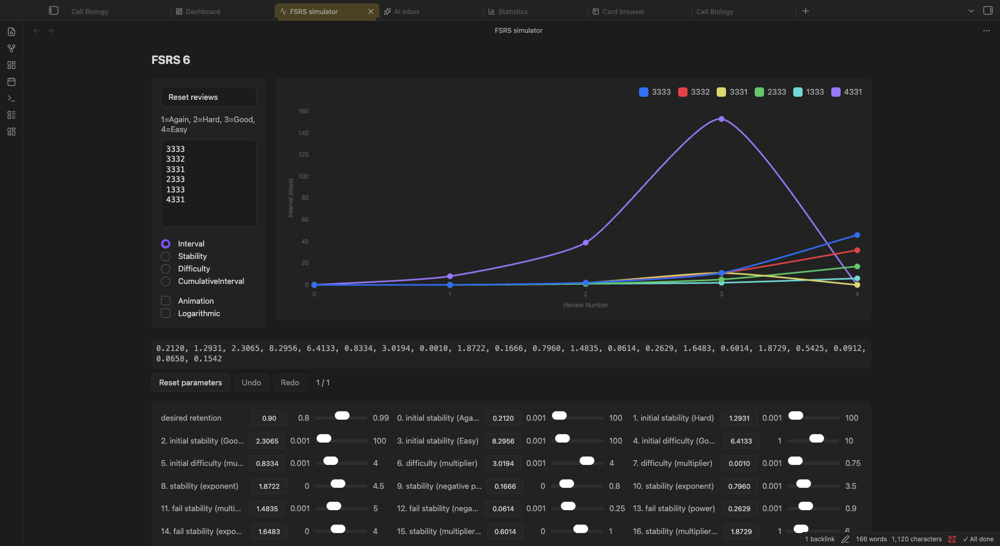

:::caution[My Notes]
:::

The **FSRS Simulator** lets you see how the scheduler behaves under different parameters and review patterns, without touching your real cards. It's the safe place to build intuition for [FSRS](/scheduling/fsrs-algorithm/) before you change a preset.

## Opening the Simulator

- **Command palette:** `Cmd/Ctrl + P` → "Open FSRS simulator"
- **Settings:** `Settings → True Recall → FSRS → "FSRS visualization" → "Open FSRS Simulator"`

## What You Can Adjust

- **Rating sequences**: a text box with one sequence per line, written as digits (`1`=Again, `2`=Hard, `3`=Good, `4`=Easy). `3333` is four Good reviews in a row; `3134` is a lapse on the second review. Each line becomes its own series on the chart, so you can compare review patterns side by side. **Reset reviews** restores the default sequences.
- **Metric**: what the chart plots for each review, **Interval**, **Stability**, **Difficulty** or **CumulativeInterval** (days elapsed since the first review).
- **Options**: **Animation** for the chart transitions and **Logarithmic** for the Y axis, which keeps early short intervals readable next to year-long ones.
- **Sliders**: **desired retention** plus each of the FSRS weights (`w0` to `w20`). Drag a slider, or type a value and press Enter. Changes are undoable, and a reset returns to the preset's parameters.

## Reading the Results

- **Chart**: how the selected metric evolves review by review under the chosen parameters, one line per rating sequence.
- **Results table**: the concrete scheduling outcomes step by step, with the **Grade** given at each review and the resulting interval, stability and difficulty.
- **Comparison sequences**: because every line in the sequence box is plotted, you can see at a glance how one Again in the middle of a run changes the schedule, or how much a higher retention target shortens intervals.

:::tip[From simulation to preset]
The simulator never writes to your cards. When a set of weights looks right, copy the values into a preset under `Settings → True Recall → FSRS → "FSRS parameters" → "Custom FSRS weights"`, or let the optimizer derive them from your review history instead. See [Presets & Optimization](/scheduling/presets/).
:::

## What to Read Next

- [The FSRS Algorithm](/scheduling/fsrs-algorithm/): what the parameters mean
- [Presets & Optimization](/scheduling/presets/): apply tuned parameters to real cards
- [Statistics](/views/statistics/): measure true retention on your actual reviews
- [Workload Management](/scheduling/workload-management/): how retention and load balancing shape daily reviews
