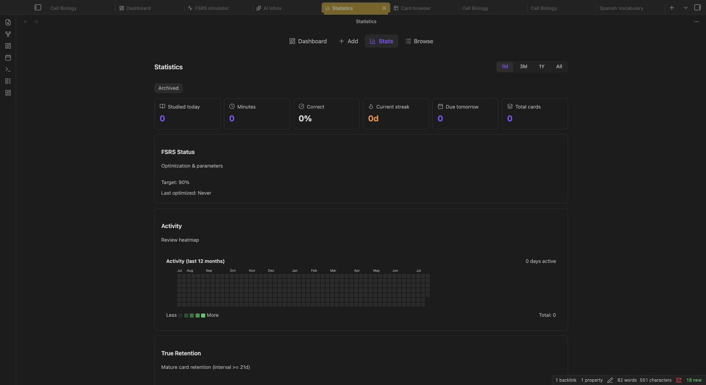

:::caution[My Notes]
:::

The **Statistics** view gives you a comprehensive picture of your learning: how much you study, how well you remember, and where to focus next. Access it from the [Dashboard](/views/dashboard/) navigation or the command palette (`Cmd/Ctrl + P` → "Open statistics").

## Today Summary



At the top you see today's snapshot:

| Metric | Description |
|--------|-------------|
| **Studied** | Reviews completed today |
| **Minutes** | Time spent reviewing |
| **New cards** | New cards introduced today |
| **Review cards** | Due cards reviewed today |
| **Again** | Number of "Again" ratings today |
| **Correct rate** | Percentage of Good + Easy ratings |

Below it, an **FSRS status** card summarizes the scheduler for the selected presets: desired retention, whether load balancing is on, and what the current parameters imply.

## Time Range

All charts below can be filtered by time range:

| Range | Description |
|-------|-------------|
| **1M** | Last 30 days |
| **3M** | Last 90 days |
| **1Y** | Last 365 days |
| **All** | Complete history |

## Activity Heatmap

The same contribution-style heatmap as on the Dashboard, showing how many cards you reviewed each day.

## True Retention

Your measured retention: the share of review-state cards you actually recalled, compared with the [Desired Retention](/scheduling/fsrs-algorithm/#desired-retention) of the selected presets. This is the number to watch when deciding whether to re-optimize parameters.

## Workload Forecast

<!-- TODO PHOTO -->

A bar chart showing how many cards are due each day in the coming weeks, split into **young** and **mature** cards, with a range picker. Use this to:

- Spot upcoming workload spikes
- Decide if you need to adjust daily limits or the daily target
- Plan around [Easy Days](/scheduling/workload-management/#easy-days) or [Scheduled Breaks](/scheduling/workload-management/#scheduled-breaks)

The forecast reflects load balancing when it is enabled, so a spread-out backlog shows up as a spread-out forecast.

## Card Maturity Breakdown

<!-- TODO PHOTO -->

A chart showing how your cards are distributed across maturity stages:

| Category | Definition |
|----------|------------|
| **New** | Never reviewed |
| **Learning** | In learning or relearning steps |
| **Young** | Review state, interval less than 21 days |
| **Mature** | Review state, interval 21 days or more |
| **Suspended** | Manually paused |
| **Buried** | Temporarily hidden (sibling burying) |

:::tip[Track Your Mature Ratio]
The percentage of Mature cards is a good measure of long-term progress. A healthy collection has most review-state cards in the Mature category, meaning their intervals are 3 weeks or longer.
:::

## Review History

<!-- TODO PHOTO -->

A daily breakdown of your review activity over the selected time range. Each day shows:

- Total reviews
- Breakdown by rating: Again, Hard, Good, Easy

## Retention History

<!-- TODO PHOTO -->

Daily retention rate as a line chart: the percentage of reviews where you rated Good or Easy. A healthy retention rate stays near your [Desired Retention](/scheduling/fsrs-algorithm/#desired-retention) target (default: 90%).

:::note
If your retention consistently falls below your target, consider [optimizing your FSRS parameters](/scheduling/presets/#parameter-training) or lowering your desired retention slightly. If it's consistently above, you may be reviewing more than necessary; raise your target to get longer intervals.
:::

## Rating Distribution

A breakdown of how you rated cards over time:

| Rating | What it means |
|--------|---------------|
| **Again** | Forgot completely |
| **Hard** | Remembered with difficulty |
| **Good** | Normal recall |
| **Easy** | Instant recall |

See [Answering Cards](/review/answering-cards/) for how each rating affects scheduling.

## Collection Health

<!-- TODO PHOTO -->

A snapshot of your entire collection's health based on current **retrievability**, the probability that you could recall each card right now:

| Health Level | Retrievability | Color |
|-------------|----------------|-------|
| **Strong** | Above 95% | Cyan |
| **High** | 85–95% | Green |
| **Medium** | 70–85% | Yellow |
| **Low** | 50–70% | Orange |
| **At Risk** | Below 50% | Red |

A healthy collection has most cards in the Strong or High categories. Cards in Low or At Risk need review soon.

## Distributions and Created vs Reviewed

<!-- TODO PHOTO -->

Histograms of stability, difficulty and retrievability across the filtered cards, and a chart comparing how many cards you created versus reviewed each day, with a cumulative line showing total collection growth. A range summary closes the page with totals for the selected time range.

## Streak

Your **current streak** (consecutive days with at least one review) and **longest streak** ever. The streak resets if you skip a full day with zero reviews.

## Note Performance

A table ranking your source notes by card performance:

| Column | Description |
|--------|-------------|
| **Source Note** | The note cards were created from |
| **Card Count** | Total cards from this note |
| **Avg Lapses** | Average times forgotten |
| **Avg Difficulty** | Average FSRS difficulty |
| **Review Count** | Total reviews across all cards |
| **Retention Rate** | Percentage correct |
| **Last Reviewed** | Most recent review date |

Use this to identify which notes produce problematic cards that might need rewriting.

## Filtering Statistics

You can filter all statistics by:

- **Preset**: see stats for a specific [FSRS preset](/scheduling/presets/) only
- **Archive status**: include or exclude archived projects

When filtered, statistics are recalculated from the review log rather than cached daily stats, so results are always accurate.

## On phones

Since 2.2.0 Statistics opens on phones with a simplified layout. Phones keep the today summary, FSRS status, heatmap, true retention, workload forecast, maturity breakdown and rating distribution; the dense charts (review history, retention history, collection health, distributions, created vs reviewed, range summary) are desktop and tablet only.

## Widgets

You can embed statistics directly in your notes with the **Embedded Dashboards** feature (`Settings → True Recall → Features → "Embedded Dashboards"`). See the full syntax and options in [Editor Integration](/configuration/editor-integration/).

Available codeblocks:

| Codeblock | Description |
|-----------|-------------|
| ` ```true-recall-dashboard``` ` | Today summary + forecast |
| ` ```true-recall-heatmap``` ` | GitHub-style activity calendar |
| ` ```true-recall-streak``` ` | Current and longest streak |
| ` ```true-recall-health``` ` | Collection health by retrievability |
| ` ```true-recall-true-retention``` ` | Rolling retention percentage |
| ` ```true-recall-forecast``` ` | Due forecast |
| ` ```true-recall-workload``` ` | Due cards graph |
| ` ```true-recall-decay``` ` | Retrievability decay for a note's cards |
| ` ```true-recall-note-stats``` ` | Stats for the current note |
| ` ```true-recall-note-health``` ` | Health of the current note's cards |
| ` ```true-recall-problem-cards``` ` | Highest-lapse cards (default limit 50) |
| ` ```true-recall-preset-info``` ` | FSRS preset parameters |
| ` ```true-recall-comparison``` ` | Compare projects or notes |
| ` ```true-recall-leaderboard``` ` | Ranking of notes or projects |
| ` ```true-recall-project``` ` | Dashboard for one project |
| ` ```true-recall-project-hub``` ` | Overview of all projects |
| ` ```true-recall-unassigned``` ` | Notes without a project |

:::note[Removed widgets]
The Gamification Widgets (`{achievements}`, `{progress}`, `{streak}`, `{countdown}`, `{maturity}`, `{ratings}`) were removed in 1.9.0. Replace them with the codeblocks above or the [Status Bar Summary](/configuration/editor-integration/).
:::

## What to Read Next

- [Dashboard](/views/dashboard/): your daily command center
- [Workload Management](/scheduling/workload-management/): shape your daily review load
- [Presets & Optimization](/scheduling/presets/): train FSRS parameters from your history
- [Card Browser](/views/card-browser/): find and manage individual cards
